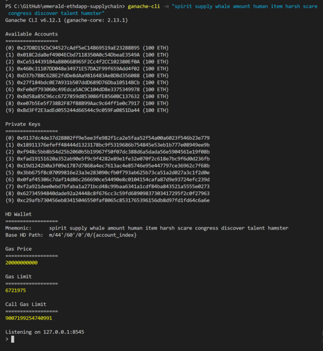

<p align="center">
   <a href="https://docs.soliditylang.org/en/v0.7.6/">
      
   </a>
   <a href="https://docs.soliditylang.org/en/v0.7.6/">
      
   </a>
   <a href="https://www.trufflesuite.com/">      
      
   </a>
   <a href="https://web3js.readthedocs.io/en/v1.3.0/">      
      
   </a>

</p>

# Emeralds supplychain Dapp

Smart contracts project with solidity for manage emeralds supply chain. 

In this project, We explore an Ethereum Dapp development for a decentralized emeralds supply chain. The main goal is reduce intermediaries from the miner to the final client. The project is developed incrementally following agile methodologies. We are going to update documents and code with each version. 

## Emeralds supply chain process

Colombia is the biggest emeralds producer worldwide; close to 60% of all emeralds production comes from there. Colombian emeralds are recognized for their quality and beautiful tones. The extraction process still handcrafts in many areas and has an extensive traders and intermediaries network. The next diagrams show a general view of actors, and steps involved in the emeralds production and trading:


The challenge is to apply blockchain to create a Decentralized App that helps trade emeralds in a trustworthy market supported by  Smart Contracts on the Ethereum platform. We start by simplifying the supply chain problem and breaking the trading cycle into two parts. The first one starts with the extraction and ends with the trading process of cut emeralds, and the second one starts with the cut emeralds and finishes when jewels with emeralds are sell to the final customer.

### Part1:


### Part2


### Part 1 description

We are focusing on process part 1 for the first Dapp version. In this version, the main goal is to reduce the intermediaries and offer a trustworthy supply chain where miners and clients (final clients or jewel producers) can trade easily with less risk. For this first Dapp version, we consider these actors:

 - **Miners:** Companies or people extracting emeralds from the mines.
 - **Laboratories:** Specialized laboratories that certify the quality grade and other emeralds properties
 - **Custodians:** Companies offering secure store for certified emeralds
 - **Manufacturers:** Companies offering cutting and polishing services transforming raw emeralds into shaped stones
 - **Jewelers:** Companies or people manufacturing jewels


### Part 2 description

Dapp's part 2 cover the process from de cut emerald to jewel creation and selling to final clients. In this part, we look for a way to directly connect the jewel makers with final clients in a trustworthy trading system. This part considers for example the transformation of a cut emerald to a luxury jewel that can use other materials (For example gold or other gems). The actors involved in this second part are:

 - **Material supplier:** Companies that provide other materials required for jewels manufacturing
 - **Jewels certifier:** Companies certifying the quality grade and jewels final properties
 - **Final client:** Final buyers of manufactured jewels

### Technical challenges

- **Contracts cost deployment:** We need to keep small contracts size and operations
- **Low storage capacity and cost:** The Ethereum networks are costly to save information, we need to Keep in the blockchain the minimum data
- **Transactions cost:** We need to minimize the transactions calls and data transfer on the network
- **Secutiry:** Managed users control and authorization for different actors involved and keep the accounts safe.


### Functional requirements

The process starts with the emerald extraction performed by the miner in the mine. The miner needs to scale the stone with information like weight, color, size, and clarity grade. These are technical parameters to a detailed description of each emerald. After scale, the emerald needs to be packeted to ship to the specialized laboratory authorized by the miner for trusted technical verifications and properties certification. Once emerald is shipped to Laboratory, this one needs to confirm the reception and do the certification process. The certified emerald is sent to a secure custodian storage service, authorized by the miner in the packaging process. The Custodian storage confirms reception, store the emerald and send a verification to the miner, who at this point, have a certified and secured emerald and can register for sale, setting up the price based on the certified properties. With the emeralds in the raw emerald in the market, the manufacturer can buy a raw emerald to cut and polish them to make a product able to be used in jewel manufacturing. The manufacturer buys the emerald, taking its ownership, and ships an order to the custodian to get the raw emerald to their processing factory. The Manufacturer process the emerald, pack for sale and register for a market sale with the new prices market. The jewel creators can search all the stones in the cut emeralds offer and buy them. When they transfer the amount to the manufacturer, they send the cut emerald to the customer location and confirm the final reception.


### Product roapmap:


### Blockchain architecture design:

To accomplish this task, we are going to use UML (Universal Modeling Language) to design architectural views of our system. The architectural views to use are:

-	**Activities model:** Describe the actor’s interactions and the flow of activities.
-	**Sequence model:** To help us to understand the actors and objects' message interchange.
-	**States diagram:** Used to let us understand emerald's state in each activity in the flow.
-	**Class model:** Express the data and functions needed in each contract.
 
### Activy diagram

 
### Sequence diagram
 
  
### States diagram


### Class diagram

 
### Contracts implementation

To understand project class organization and contract implementation we need to consider the external libraries and folders. This is presented in the next diagram:


 
## Project write-up - Libraries

We use openzeppely library to implements accesscontrol and ownable contracts for an easy role and authorization management. The development uses Truffle framework, web3 to interact with the contract and `truffle-hd-wallet-provider` to sign transactions for addresses.

 - Oppenzeppelin: (https://docs.openzeppelin.com/openzeppelin/)
 - Truffle: (https://www.trufflesuite.com/)
 - web3: (https://web3js.readthedocs.io/en/v1.3.0/)

## IPFS

IPFS is not used in this Dapp version.

IPFS: (https://ipfs.io/)


## Installing 

Clone this repository

      ```
      git clone https://github.com/Fer-Bonilla/emerald-ethdapp-supplychain
      ```

change the directory to emerald-ethdapp-supplychain and install all requisite npm packages 

      ```
      cd emerald-ethdapp-supplychain
      npm install
      ```

Launch Ganache:

      ```
      ganache-cli -m "spirit supply whale amount human item harsh scare congress discover talent hamster"
      ```

## Contracts deployment to Kovan test network 

To deploy the contratcs on Kovan network, it's neccessary setup the truffle-config.js file with this:

    ```
    kovan: {
      // must be a thunk, otherwise truffle commands may hang in CI
      provider: () =>
        new HDWalletProvider({
          mnemonic: {
            phrase: mnemonicPhrase
          },
          providerOrUrl: infuraKovan,
          gas: 5500000,    
          confirmations: 2,
          timeoutBlocks: 200,
          skipDryRun: true, 
          shareNonce: true
        }),
      network_id: '42',
    }
    ```

Your terminal should look something like this:


**The adress for the supplychaon contract on the rinkeby network is:** 0x27D8D15CbC94527cAdf5eC14B69519aE23288B95
**Link to Etherscan:** https://kovan.etherscan.io/tx/0x7a984f8179eb26fafe67d6620f5412e603189c0d02317599d522fac8c54f0cb8

### Deploying migrations
```
   ======================
   > Network name:    'kovan'
   > Network id:      42
   > Block gas limit: 12500000 (0xbebc20)
```
```
   1_initial_migration.js
   ======================

      Deploying 'Migrations'
      ----------------------
      > transaction hash:    0x5e823a9832899b94c9a3469f1145a4b16237870aada6db711517014c53472dca
      > Blocks: 1            Seconds: 12
      > contract address:    0xB09E439d7D04637Bf1897b70e07CccCcBf77e292     
      > block number:        23618366
      > block timestamp:     1614109664
      > account:             0x27D8D15CbC94527cAdf5eC14B69519aE23288B95     
      > balance:             1.761500462
      > gas used:            168490 (0x2922a)
      > gas price:           20 gwei
      > value sent:          0 ETH
      > total cost:          0.0033698 ETH
      > 
      > Saving migration to chain.
      > Saving artifacts
      -------------------------------------
      > Total cost:           0.0033698 ETH
```

### Deploying contracts

```
2_deploy_contracts.js
=====================

   Deploying 'CustomerRole'
   ------------------------
   > transaction hash:    0xc6c7aa847ddd203625a745cdef5f9c5b004adeff11ada1a8e18faa331791ac2c
   > Blocks: 2            Seconds: 12
   > contract address:    0x9e52D8Eafc46fB48FeDa1566995204759e62bE4E     
   > block number:        23618371
   > block timestamp:     1614109692
   > account:             0x27D8D15CbC94527cAdf5eC14B69519aE23288B95     
   > balance:             1.747312982
   > gas used:            667095 (0xa2dd7)
   > gas price:           20 gwei
   > value sent:          0 ETH
   > total cost:          0.0133419 ETH


   Deploying 'CustodianRole'
   -------------------------
   > transaction hash:    0x4b0efebbf529db1a1a6cab828511c3e8e2263ac317b32acff3c3f01de7aeebaa
   > Blocks: 1            Seconds: 10
   > contract address:    0x6ccb74f73f4F518e7b60c017fD4b0956AeE7C138     
   > block number:        23618374
   > block timestamp:     1614109708
   > account:             0x27D8D15CbC94527cAdf5eC14B69519aE23288B95     
   > balance:             1.733971802
   > gas used:            667059 (0xa2db3)
   > gas price:           20 gwei
   > value sent:          0 ETH
   > total cost:          0.01334118 ETH


   Deploying 'LaboratoryRole'
   --------------------------
   > transaction hash:    0x72c3ab5d4d35899bba0430dcc5116a689ed0e1bca1fb39b86e96a348066a2194
   > Blocks: 1            Seconds: 8
   > contract address:    0xB1010deAF9287235264808921ad953e6F703c536     
   > block number:        23618377
   > block timestamp:     1614109724
   > account:             0x27D8D15CbC94527cAdf5eC14B69519aE23288B95     
   > balance:             1.720630862
   > gas used:            667047 (0xa2da7)
   > gas price:           20 gwei
   > value sent:          0 ETH
   > total cost:          0.01334094 ETH


   Deploying 'ManufacturerRole'
   ----------------------------
   > transaction hash:    0x2df3ed46a3d3dea463103f43382915338e94c0f7eb55151f5d2d387fc142beaf
   > Blocks: 1            Seconds: 9
   > contract address:    0x8BeCC9336c6a9efEAB4D3112ed2A043d7963D899     
   > block number:        23618380
   > block timestamp:     1614109740
   > account:             0x27D8D15CbC94527cAdf5eC14B69519aE23288B95     
   > balance:             1.707287282
   > gas used:            667179 (0xa2e2b)
   > gas price:           20 gwei
   > value sent:          0 ETH
   > total cost:          0.01334358 ETH


   Deploying 'MinerRole'
   ---------------------
   > transaction hash:    0x39373d7446b83e0adcdd20c917585f516b6e8dadaac8653b90166c92878456a8
   > Blocks: 1            Seconds: 8
   > contract address:    0x6708966d8E6B4B312eb40C8B6EFc29595D7eAE22     
   > block number:        23618383
   > block timestamp:     1614109756
   > account:             0x27D8D15CbC94527cAdf5eC14B69519aE23288B95     
   > balance:             1.694255962
   > gas used:            651566 (0x9f12e)
   > gas price:           20 gwei
   > value sent:          0 ETH
   > total cost:          0.01303132 ETH


   Deploying 'Emerald'
   -------------------
   > transaction hash:    0x393e4fcbd685347a0c274d43c1f3a01ea89e69ecd806392e379624dac3e7aa74
   > Blocks: 3            Seconds: 12
   > contract address:    0x864175F6267785d0371495eaeBc2eB6437C79Bf8     
   > block number:        23618386
   > block timestamp:     1614109772
   > account:             0x27D8D15CbC94527cAdf5eC14B69519aE23288B95     
   > balance:             1.675182962
   > gas used:            953650 (0xe8d32)
   > gas price:           20 gwei
   > value sent:          0 ETH
   > total cost:          0.019073 ETH


   Deploying 'EmeraldProperties'
   -----------------------------
   > transaction hash:    0x9727938a73299492a3df58b38bf812f9483e60cf92fdfb9d15dc52a3b5199e67
   > Blocks: 2            Seconds: 12
   > contract address:    0x2B06a855144963710c4B6c375AD5A2e35B3983d9     
   > block number:        23618389
   > block timestamp:     1614109788
   > account:             0x27D8D15CbC94527cAdf5eC14B69519aE23288B95     
   > balance:             1.669427102
   > gas used:            287793 (0x46431)
   > gas price:           20 gwei
   > value sent:          0 ETH
   > total cost:          0.00575586 ETH


   Deploying 'EmeraldStates'
   -------------------------
   > transaction hash:    0xb69c874fa94a8b3550a6a0e929c44f91a73352b742c20009eede21d3c820d873
   > Blocks: 3            Seconds: 12
   > contract address:    0x6153F64891F9c7586d1e239018408D3bB8CAe8F0     
   > block number:        23618392
   > block timestamp:     1614109804
   > account:             0x27D8D15CbC94527cAdf5eC14B69519aE23288B95     
   > balance:             1.668085782
   > gas used:            67066 (0x105fa)
   > gas price:           20 gwei
   > value sent:          0 ETH
   > total cost:          0.00134132 ETH


   Deploying 'SupplyChain'
   -----------------------
   > transaction hash:    0x7ac8c0eec02b6069d2e4f9d898973b1a1734ef55ab947ec79f53581e3ef4ecaa
   > Blocks: 3            Seconds: 12
   > contract address:    0x5298849E13c020D24F8eD7efAF927149C6C1ddFc     
   > block number:        23618395
   > block timestamp:     1614109820
   > account:             0x27D8D15CbC94527cAdf5eC14B69519aE23288B95     
   > balance:             1.555398042
   > gas used:            5634387 (0x55f953)
   > gas price:           20 gwei
   > value sent:          0 ETH
   > total cost:          0.11268774 ETH


   > Saving migration to chain.
   > Saving artifacts
   -------------------------------------
   > Total cost:          0.20525684 ETH


Summary
=======
> Total deployments:   10
> Final cost:          0.20862664 ETH

```

## Getting Started

These instructions will get you a copy of the project up and running on your local machine for development and testing purposes. See deployment for notes on how to deploy the project on a live system.

### Prerequisites

Please make sure you've already installed ganache-cli, Truffle and enabled MetaMask extension in your browser.

```
Give examples (to be clarified)
```

### Installing

A step by step series of examples that tell you have to get a development env running

Clone this repository:

```
git clone https://github.com/udacity/nd1309/tree/master/course-5/project-6
```

Change directory to ```project-6``` folder and install all requisite npm packages (as listed in ```package.json```):

```
cd project-6
npm install
```

Launch Ganache:

```
ganache-cli -m "spirit supply whale amount human item harsh scare congress discover talent hamster"
```

Your terminal should look something like this:



In a separate terminal window, Compile smart contracts:

```
truffle compile
```

Your terminal should look something like this:


This will create the smart contract artifacts in folder ```build\contracts```.

Migrate smart contracts to the locally running blockchain, ganache-cli:

```
truffle migrate
```

Your terminal should look something like this:


Test smart contracts:

```
truffle test
```

All 10 tests should pass.


In a separate terminal window, launch the DApp:

```
npm run dev
```

## Built With

* [Ethereum](https://www.ethereum.org/) - Ethereum is a decentralized platform that runs smart contracts
* [IPFS](https://ipfs.io/) - IPFS is the Distributed Web | A peer-to-peer hypermedia protocol
to make the web faster, safer, and more open.
* [Truffle Framework](http://truffleframework.com/) - Truffle is the most popular development framework for Ethereum with a mission to make your life a whole lot easier.


## Authors

See also the list of [contributors](https://github.com/your/project/contributors.md) who participated in this project.

## Acknowledgments

* Solidity
* Ganache-cli
* Truffle
* IPFS
